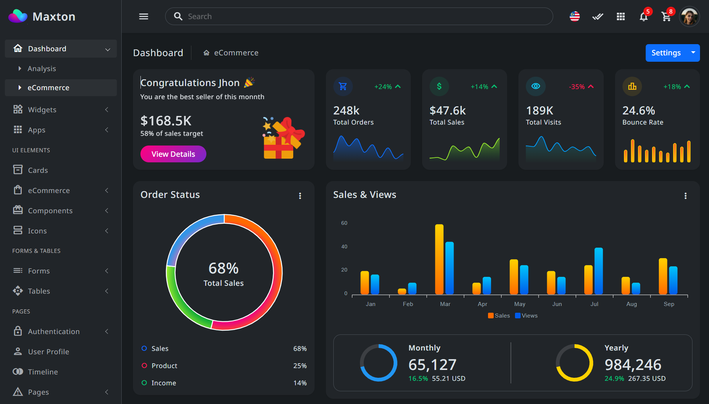

# 🏫 School Management System

A Node.js-based application designed to simplify and automate school administrative tasks such as managing students, teachers, classes, attendance, and more.

---

## 📚 Table of Contents
- <a href="https://getbootstrap.com" target="_blank">Features</a>

- <a href="https://getbootstrap.com" target="_blank">Tech Stack</a>

- <a href="https://getbootstrap.com" target="_blank">Installation</a>

- <a href="https://getbootstrap.com" target="_blank">Usage</a>

- <a href="https://getbootstrap.com" target="_blank">API Endpoints</a>

- <a href="https://getbootstrap.com" target="_blank">Environment Variables</a>

- <a href="https://getbootstrap.com" target="_blank">Scripts</a>

- <a href="https://getbootstrap.com" target="_blank">Contributing</a>

- <a href="https://getbootstrap.com" target="_blank">Contributors</a>

- <a href="https://getbootstrap.com" target="_blank">License</a>

---
## ✨ Features
- Student & Teacher Management
- Class & Subject Assignment
- Attendance Tracking
- User Authentication(JWT)
- Admn Dashboard

---
## 🛠 Tech Stack
- Programming Language: JavaScript (Node.js)
- Runtime: Node.js
- Framework: Express.js
- Database: MongoDB / Mongoose (or MySQL / Sequelize)
- Authentication: JSON Web Token(JWL)
- Environment Management: dotenv
- Testing: Jest / Mocha (optional)

---
## 🚀 Installation

Clone the project and install dependencies:

git clone https://github.com/your-username/school-management-system.git
cd school-management-system
npm install

## Screenshot

## 🔧 Usage
To run the server in development mode:
npm run dev
To start the server normally:
npm start
Access the API at
http://localhost:3000/api
## 📮 API Endpoints

|Method | Endpoint | Description |
|------ | -------- | ----------- |
|POST | /api/auth/login | Login to system   |
|GET | /api/students |  Login to system  |
|POST | /api/students | Login to system   |
|PUT | /api/students | Login to system   |
|DELETE | /api/students | Login to system   |
## 🔑 Environment Variablesb
Create a .env file in the root directory and add:
PORT=3000
DB_URI=your_database_connection_string
JWT_SECRET=your_jwt_secret_key
## 🧪 Scripts
npm start       # Start the server
npm run dev     # Start with nodemon
npm test        # Run test cases
## 👥 Contributors

## 📄 License

This project is licensed under the MIT License. See the LICENSE file for more details.

---

Let me know:
- if your project uses MongoDB or MySQL (so I can adjust that part),
- if you want to include screenshots or setup diagrams,
- or if you'd like this saved as a downloadable `.md` file.